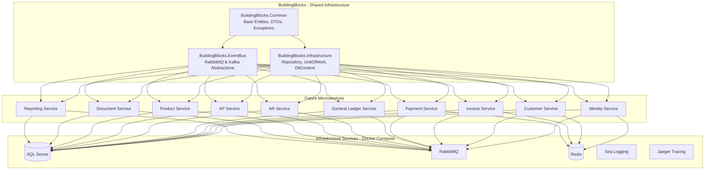

I have created the following plan after thorough exploration and analysis of the codebase. Follow the below plan verbatim. Trust the files and references. Do not re-verify what's written in the plan. Explore only when absolutely necessary. First implement all the proposed file changes and then I'll review all the changes together at the end.

# Implementation Plan: .NET 10 Solution Structure with Shared Infrastructure

## Observations

This is a greenfield project starting from an empty workspace. The foundation will support a full-featured accounting system with multiple microservices (Identity, Customer, Product, Invoice, Payment, General Ledger, AR, AP, Reporting, Document). The infrastructure must support event-driven architecture with RabbitMQ/Kafka, OAuth2/OpenID Connect authentication, and Docker containerization. The BuildingBlocks libraries will provide shared abstractions and implementations used across all microservices.

## Approach

The solution will follow Clean Architecture principles with clear separation between BuildingBlocks (shared infrastructure) and Services (microservices). Each BuildingBlocks library will provide reusable components: Common for cross-cutting concerns, EventBus for message broker abstractions, and Infrastructure for data access patterns. The Docker Compose setup will orchestrate all development dependencies (SQL Server, RabbitMQ, Redis) to enable immediate local development. This foundation ensures consistency, reduces code duplication, and accelerates subsequent microservice development.

## Implementation Steps

### 1. Create Root Solution Structure

Create the following directory hierarchy in `d:\Development\Classified\`:

```
AccountingSystem/
├── src/
│   ├── BuildingBlocks/
│   │   ├── Common/
│   │   ├── EventBus/
│   │   └── Infrastructure/
│   ├── Services/
│   │   └── (future microservices will go here)
│   └── ApiGateway/
│       └── (future API Gateway will go here)
├── tests/
│   └── (future test projects will go here)
├── docker/
│   └── (docker-related files)
├── docs/
│   └── (documentation)
├── AccountingSystem.sln
├── docker-compose.yml
├── docker-compose.override.yml
├── .dockerignore
├── .gitignore
└── README.md
```

Create the solution file using:
```bash
dotnet new sln -n AccountingSystem
```

### 2. Create BuildingBlocks.Common Library

**Purpose**: Shared cross-cutting concerns, base classes, and utilities used across all microservices.

Create the project:
```bash
dotnet new classlib -n BuildingBlocks.Common -f net10.0
dotnet sln add src/BuildingBlocks/Common/BuildingBlocks.Common.csproj
```

**Required NuGet Packages**:
- `Microsoft.Extensions.Logging.Abstractions` (for logging)
- `FluentValidation` (for validation)
- `MediatR.Contracts` (for CQRS pattern support)

**Components to implement**:

**Base Entities** (`Entities/` folder):
- `Entity<TId>`: Abstract base class with `Id` property, equality comparison
- `AggregateRoot<TId>`: Extends `Entity`, adds domain events collection
- `IAuditableEntity`: Interface with `CreatedAt`, `CreatedBy`, `UpdatedAt`, `UpdatedBy`
- `ISoftDeletable`: Interface with `IsDeleted`, `DeletedAt`, `DeletedBy`
- `ValueObject`: Abstract base class for value objects with equality comparison

**DTOs** (`DTOs/` folder):
- `PagedResult<T>`: Generic paged response with `Items`, `TotalCount`, `PageNumber`, `PageSize`
- `ApiResponse<T>`: Standard API response wrapper with `Success`, `Data`, `Message`, `Errors`
- `ErrorDetails`: Error information with `Code`, `Message`, `Field`

**Exceptions** (`Exceptions/` folder):
- `DomainException`: Base exception for domain-level errors
- `NotFoundException`: For entity not found scenarios
- `ValidationException`: For validation failures
- `BusinessRuleViolationException`: For business rule violations
- `ConflictException`: For conflict scenarios (e.g., duplicate entries)

**Interfaces** (`Interfaces/` folder):
- `IDateTime`: Abstraction for system time (testability)
- `ICurrentUserService`: Abstraction for current user context
- `IDomainEventDispatcher`: For dispatching domain events

**Extensions** (`Extensions/` folder):
- `StringExtensions`: Common string operations
- `DateTimeExtensions`: Date/time utilities
- `EnumerableExtensions`: Collection utilities

**Constants** (`Constants/` folder):
- `ErrorCodes`: Centralized error code constants
- `ValidationMessages`: Validation message templates

### 3. Create BuildingBlocks.EventBus Library

**Purpose**: Message broker abstractions and implementations for event-driven communication.

Create the project:
```bash
dotnet new classlib -n BuildingBlocks.EventBus -f net10.0
dotnet sln add src/BuildingBlocks/EventBus/BuildingBlocks.EventBus.csproj
```

Add reference to BuildingBlocks.Common:
```bash
dotnet add src/BuildingBlocks/EventBus reference src/BuildingBlocks/Common
```

**Required NuGet Packages**:
- `RabbitMQ.Client` (for RabbitMQ implementation)
- `Confluent.Kafka` (for Kafka implementation)
- `Microsoft.Extensions.DependencyInjection.Abstractions`
- `Microsoft.Extensions.Logging.Abstractions`
- `Polly` (for resilience and retry policies)

**Components to implement**:

**Abstractions** (`Abstractions/` folder):
- `IIntegrationEvent`: Marker interface for integration events with `EventId`, `OccurredOn`
- `IEventBus`: Interface with `PublishAsync<T>`, `SubscribeAsync<T, TH>`
- `IIntegrationEventHandler<T>`: Interface with `HandleAsync(T @event)`
- `IEventBusSubscriptionsManager`: Manages event subscriptions

**Base Classes** (`Events/` folder):
- `IntegrationEvent`: Base class implementing `IIntegrationEvent` with `EventId` (Guid), `OccurredOn` (DateTime)

**RabbitMQ Implementation** (`RabbitMQ/` folder):
- `RabbitMQEventBus`: Implements `IEventBus` using RabbitMQ
- `RabbitMQConnection`: Manages persistent connection to RabbitMQ
- `RabbitMQEventBusOptions`: Configuration options (host, port, username, password, exchange name, queue name)
- `RabbitMQServiceCollectionExtensions`: DI registration extensions

**Kafka Implementation** (`Kafka/` folder):
- `KafkaEventBus`: Implements `IEventBus` using Kafka
- `KafkaProducerService`: Manages Kafka producer
- `KafkaConsumerService`: Manages Kafka consumer
- `KafkaEventBusOptions`: Configuration options (bootstrap servers, topic prefix, consumer group)
- `KafkaServiceCollectionExtensions`: DI registration extensions

**Subscription Management** (`Subscriptions/` folder):
- `InMemoryEventBusSubscriptionsManager`: In-memory implementation of `IEventBusSubscriptionsManager`
- `SubscriptionInfo`: Holds handler type information

**Resilience** (`Resilience/` folder):
- `EventBusRetryPolicy`: Polly-based retry policies for transient failures
- `CircuitBreakerPolicy`: Circuit breaker for event publishing

### 4. Create BuildingBlocks.Infrastructure Library

**Purpose**: Data access patterns, database context base, repository pattern, and unit of work.

Create the project:
```bash
dotnet new classlib -n BuildingBlocks.Infrastructure -f net10.0
dotnet sln add src/BuildingBlocks/Infrastructure/BuildingBlocks.Infrastructure.csproj
```

Add reference to BuildingBlocks.Common:
```bash
dotnet add src/BuildingBlocks/Infrastructure reference src/BuildingBlocks/Common
```

**Required NuGet Packages**:
- `Microsoft.EntityFrameworkCore` (version 10.x)
- `Microsoft.EntityFrameworkCore.SqlServer`
- `Microsoft.EntityFrameworkCore.Design`
- `Microsoft.EntityFrameworkCore.Relational`
- `Microsoft.Extensions.Configuration.Abstractions`
- `MediatR` (for domain event dispatching)

**Components to implement**:

**Database Context** (`Persistence/` folder):
- `BaseDbContext`: Abstract `DbContext` with:
  - Automatic audit field population (CreatedAt, UpdatedAt, etc.)
  - Soft delete query filters
  - Domain event dispatching before SaveChanges
  - Override `SaveChangesAsync` to handle auditing and events
  - Configuration for common conventions (decimal precision, string max length defaults)

**Repository Pattern** (`Repositories/` folder):
- `IRepository<TEntity, TId>`: Generic repository interface with:
  - `GetByIdAsync(TId id)`
  - `GetAllAsync()`
  - `FindAsync(Expression<Func<TEntity, bool>> predicate)`
  - `AddAsync(TEntity entity)`
  - `UpdateAsync(TEntity entity)`
  - `DeleteAsync(TId id)`
  - `ExistsAsync(TId id)`
  - `CountAsync(Expression<Func<TEntity, bool>> predicate)`
  - `GetPagedAsync(int pageNumber, int pageSize, Expression<Func<TEntity, bool>> predicate)`

- `Repository<TEntity, TId>`: Generic repository implementation using EF Core
  - Implements `IRepository<TEntity, TId>`
  - Uses `DbSet<TEntity>` from injected `DbContext`
  - Includes tracking/no-tracking query options

**Unit of Work** (`UnitOfWork/` folder):
- `IUnitOfWork`: Interface with:
  - `IRepository<TEntity, TId> Repository<TEntity, TId>()`
  - `Task<int> SaveChangesAsync(CancellationToken cancellationToken)`
  - `Task BeginTransactionAsync()`
  - `Task CommitTransactionAsync()`
  - `Task RollbackTransactionAsync()`

- `UnitOfWork`: Implementation managing:
  - Repository instances (cached per entity type)
  - Transaction management using `DbContext.Database.BeginTransactionAsync()`
  - Coordinated save across multiple repositories

**Specifications Pattern** (`Specifications/` folder):
- `ISpecification<T>`: Interface with `Expression<Func<T, bool>> Criteria`, `List<Expression<Func<T, object>>> Includes`
- `BaseSpecification<T>`: Base implementation for building complex queries
- `SpecificationEvaluator`: Applies specifications to `IQueryable<T>`

**Interceptors** (`Interceptors/` folder):
- `AuditableEntitySaveChangesInterceptor`: EF Core interceptor to automatically set audit fields
- `SoftDeleteInterceptor`: Intercepts delete operations to set `IsDeleted` flag instead

**Extensions** (`Extensions/` folder):
- `ModelBuilderExtensions`: Extension methods for common EF Core configurations
  - `ApplyAuditableEntityConfiguration()`
  - `ApplySoftDeleteQueryFilter()`
  - `ApplyDecimalPrecisionConfiguration()`
- `InfrastructureServiceCollectionExtensions`: DI registration for repositories and unit of work

**Migrations** (`Migrations/` folder):
- `MigrationExtensions`: Helper methods for applying migrations programmatically

### 5. Create Docker Compose Configuration

**Purpose**: Orchestrate development environment with all required infrastructure services.

Create `docker-compose.yml` in the root directory:

**Services to include**:

1. **SQL Server** (for all microservice databases):
   - Image: `mcr.microsoft.com/mssql/server:2022-latest`
   - Environment: `ACCEPT_EULA=Y`, `SA_PASSWORD=YourStrong@Passw0rd`
   - Ports: `1433:1433`
   - Volumes: `sqlserver-data:/var/opt/mssql`
   - Health check: SQL Server readiness probe

2. **RabbitMQ** (message broker):
   - Image: `rabbitmq:3-management`
   - Ports: `5672:5672` (AMQP), `15672:15672` (Management UI)
   - Environment: `RABBITMQ_DEFAULT_USER=guest`, `RABBITMQ_DEFAULT_PASS=guest`
   - Volumes: `rabbitmq-data:/var/lib/rabbitmq`
   - Health check: RabbitMQ readiness probe

3. **Redis** (caching and distributed locking):
   - Image: `redis:7-alpine`
   - Ports: `6379:6379`
   - Volumes: `redis-data:/data`
   - Command: `redis-server --appendonly yes`

4. **Seq** (centralized logging):
   - Image: `datalust/seq:latest`
   - Ports: `5341:80` (UI), `5342:5341` (ingestion)
   - Environment: `ACCEPT_EULA=Y`
   - Volumes: `seq-data:/data`

5. **Jaeger** (distributed tracing):
   - Image: `jaegertracing/all-in-one:latest`
   - Ports: `6831:6831/udp`, `16686:16686` (UI), `14268:14268`
   - Environment: `COLLECTOR_OTLP_ENABLED=true`

**Networks**:
- Create a custom bridge network named `accounting-network` for all services

**Volumes**:
- Define named volumes for data persistence: `sqlserver-data`, `rabbitmq-data`, `redis-data`, `seq-data`

Create `docker-compose.override.yml` for local development overrides:
- Environment-specific configurations
- Port mappings for debugging
- Volume mounts for hot reload (future microservices)

Create `.dockerignore`:
```
**/bin/
**/obj/
**/out/
**/.vs/
**/.vscode/
**/*.user
**/.git/
**/node_modules/
**/dist/
```

### 6. Add Supporting Configuration Files

**Create `.gitignore`**:
- Standard .NET gitignore template
- Add Docker-specific ignores
- Add IDE-specific ignores (Visual Studio, Rider, VS Code)

**Create `README.md`**:
- Project overview and architecture diagram
- Prerequisites (.NET 10 SDK, Docker Desktop)
- Getting started instructions
- How to run with Docker Compose: `docker-compose up -d`
- How to build solution: `dotnet build`
- Project structure explanation
- Links to documentation

**Create `Directory.Build.props`** (root level):
- Centralized project properties for all projects:
  - Target framework: `net10.0`
  - Nullable reference types: enabled
  - Implicit usings: enabled
  - Common package versions (centralized package management)
  - Code analysis rules
  - Treat warnings as errors (for production quality)

**Create `Directory.Packages.props`** (for Central Package Management):
- Define all NuGet package versions centrally
- Enable `<ManagePackageVersionsCentrally>true</ManagePackageVersionsCentrally>`
- List all common packages with versions

**Create `global.json`**:
- Specify .NET SDK version (10.0.x)
- Rollforward policy

### 7. Add Development Tools Configuration

**Create `launchSettings.json`** templates for future microservices in `docker/templates/`:
- HTTP/HTTPS profiles
- Docker profile
- Environment variables template

**Create `appsettings.json`** template in `docker/templates/`:
- Logging configuration (Seq, Console)
- Connection strings template
- RabbitMQ/Kafka configuration template
- Redis configuration template
- OpenTelemetry configuration template

### 8. Documentation Structure

Create documentation in `docs/` folder:

**`docs/architecture.md`**:
- High-level architecture overview
- Microservices diagram
- Event-driven communication flows
- Database per service pattern explanation

**`docs/building-blocks.md`**:
- Detailed explanation of each BuildingBlocks library
- Usage examples for Common, EventBus, Infrastructure
- Best practices for extending

**`docs/development-setup.md`**:
- Step-by-step local development setup
- Docker Compose usage
- Database migration workflow
- Debugging microservices locally

**`docs/coding-standards.md`**:
- Naming conventions
- Code organization patterns
- Error handling guidelines
- Logging standards

## Architecture Diagram



## Verification Steps

After implementation, verify the foundation is ready:

1. **Solution builds successfully**: Run `dotnet build` from root directory
2. **Docker Compose starts all services**: Run `docker-compose up -d` and verify all containers are healthy
3. **Access infrastructure UIs**:
   - RabbitMQ Management: http://localhost:15672
   - Seq Logging: http://localhost:5341
   - Jaeger Tracing: http://localhost:16686
4. **SQL Server connectivity**: Connect using SQL Server Management Studio or Azure Data Studio to `localhost,1433`
5. **BuildingBlocks libraries reference correctly**: Verify no circular dependencies
6. **NuGet packages restore**: Run `dotnet restore` successfully

## Next Steps for Team

Once this foundation is complete, the team can proceed with:
- **API Gateway setup** (Ocelot/YARP configuration)
- **Identity Service implementation** (OAuth2/OpenID Connect)
- **First business microservice** (Customer Service recommended as starting point)

Each microservice will reference the BuildingBlocks libraries and follow the established patterns for consistency.