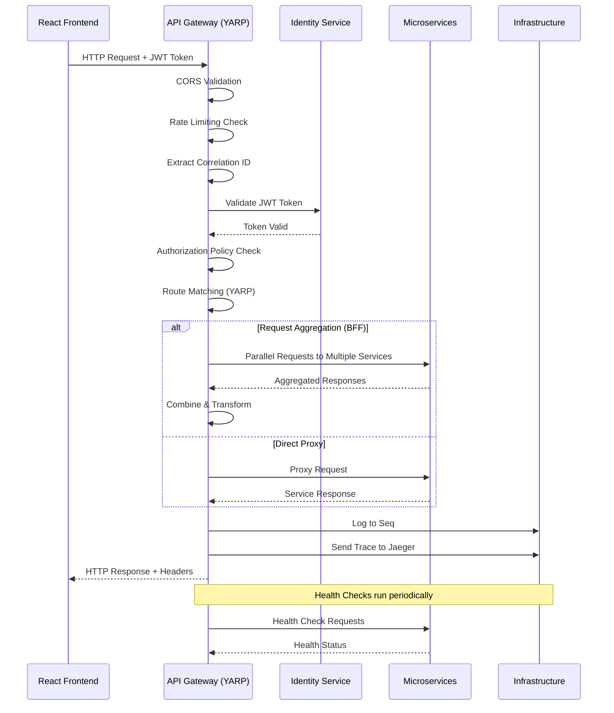

I have created the following plan after thorough exploration and analysis of the codebase. Follow the below plan verbatim. Trust the files and references. Do not re-verify what's written in the plan. Explore only when absolutely necessary. First implement all the proposed file changes and then I'll review all the changes together at the end.

## Observations

The solution structure is well-established with BuildingBlocks libraries for Common utilities, EventBus (RabbitMQ/Kafka), and Infrastructure (Repository/UnitOfWork patterns). The docker-compose.yml already includes SQL Server, RabbitMQ, Redis, Seq (logging), and Jaeger (tracing). The project uses .NET 10 with centralized package management via Directory.Build.props and Directory.Packages.props. No services or API Gateway exist yet, making this the first service-facing component to be implemented.

## Approach

The implementation will use **YARP (Yet Another Reverse Proxy)** as the API Gateway due to its superior performance, Microsoft backing, native gRPC support, and deep ASP.NET Core integration. The gateway will leverage ASP.NET Core's built-in rate limiting middleware (available since .NET 7), implement health checks for all downstream services, configure CORS for the React frontend, and include custom middleware for request aggregation in BFF scenarios. Service discovery will be configured using Microsoft.Extensions.ServiceDiscovery.Yarp for dynamic service resolution. The implementation follows the existing patterns in BuildingBlocks with extension methods and clean separation of concerns.

## Implementation Steps

### 1. Create API Gateway Project Structure

Create a new ASP.NET Core Web API project at `file:src/ApiGateway/ApiGateway.csproj`:

- Target framework: `net10.0`
- Project type: ASP.NET Core Minimal API or Web API
- Add project references to `file:src/BuildingBlocks/Common/BuildingBlocks.Common.csproj`
- Create folder structure:
  - `file:src/ApiGateway/Configuration/` - for YARP route configurations
  - `file:src/ApiGateway/Middleware/` - for custom middleware
  - `file:src/ApiGateway/Extensions/` - for service registration extensions
  - `file:src/ApiGateway/Aggregation/` - for request aggregation endpoints
  - `file:src/ApiGateway/HealthChecks/` - for custom health check implementations

### 2. Add Required NuGet Packages

Update `file:Directory.Packages.props` to include:

- `Yarp.ReverseProxy` version 2.3.0 or latest
- `Microsoft.Extensions.ServiceDiscovery.Yarp` for service discovery integration
- `Microsoft.AspNetCore.RateLimiting` (built into .NET 10, but explicit reference for clarity)
- `Microsoft.Extensions.Diagnostics.HealthChecks` for health checks
- `Microsoft.Extensions.Diagnostics.HealthChecks.EntityFrameworkCore` for database health checks
- `AspNetCore.HealthChecks.Rabbitmq` for RabbitMQ health checks
- `AspNetCore.HealthChecks.Redis` for Redis health checks
- `AspNetCore.HealthChecks.SqlServer` for SQL Server health checks
- `AspNetCore.HealthChecks.UI.Client` for health check UI rendering
- `Serilog.AspNetCore` for structured logging integration with Seq
- `Serilog.Sinks.Seq` for Seq sink
- `OpenTelemetry.Exporter.Jaeger` for distributed tracing with Jaeger
- `OpenTelemetry.Extensions.Hosting` for OpenTelemetry integration
- `OpenTelemetry.Instrumentation.AspNetCore` for ASP.NET Core instrumentation

### 3. Configure YARP Routing

Create `file:src/ApiGateway/appsettings.json` with YARP configuration:

**Route Configuration Structure:**
- Define routes for all microservices (Identity, Customer, Product, Invoice, Payment, GeneralLedger, AccountsReceivable, AccountsPayable, Reporting, Document)
- Use path-based routing: `/api/identity/**`, `/api/customers/**`, `/api/products/**`, `/api/invoices/**`, `/api/payments/**`, `/api/gl/**`, `/api/ar/**`, `/api/ap/**`, `/api/reports/**`, `/api/documents/**`
- Configure clusters with service discovery addresses (e.g., `http://identity-service`, `http://customer-service`)
- Add health check configuration for each cluster with active and passive health checks
- Configure load balancing strategy (e.g., RoundRobin, LeastRequests)
- Add timeout configurations (request timeout, connect timeout)

**Transformations:**
- Add request header transformations to forward authentication tokens
- Add correlation ID header for distributed tracing
- Strip path prefixes where necessary (e.g., `/api/customers` → `/`)
- Add response header transformations for security headers

Create `file:src/ApiGateway/Configuration/ReverseProxyConfig.cs` for programmatic route configuration as an alternative to JSON-based configuration.

### 4. Implement Rate Limiting

Create `file:src/ApiGateway/Extensions/RateLimitingExtensions.cs`:

**Rate Limiting Policies:**
- **Global Policy**: Fixed window limiter (100 requests per minute per IP)
- **Authentication Policy**: Sliding window limiter (20 requests per minute for auth endpoints)
- **API Policy**: Token bucket limiter (1000 requests per hour per authenticated user)
- **Reporting Policy**: Concurrency limiter (5 concurrent requests for heavy report generation)

**Implementation Details:**
- Use `AddRateLimiter()` to configure rate limiting service
- Define policies using `FixedWindowRateLimiter`, `SlidingWindowRateLimiter`, `TokenBucketRateLimiter`, and `ConcurrencyLimiter`
- Partition by IP address for anonymous requests and by user ID for authenticated requests
- Configure rejection status code (429 Too Many Requests) and retry-after headers
- Add custom rejection response with error details using `BuildingBlocks.Common.DTOs.ErrorDetails`

Apply rate limiting policies to specific routes in YARP configuration using metadata or apply globally via middleware.

### 5. Configure CORS for React Frontend

Create `file:src/ApiGateway/Extensions/CorsExtensions.cs`:

**CORS Policy Configuration:**
- Policy name: "ReactFrontendPolicy"
- Allowed origins: Configure from `appsettings.json` (e.g., `http://localhost:3000`, `http://localhost:5173` for Vite, production URLs)
- Allowed methods: GET, POST, PUT, DELETE, PATCH, OPTIONS
- Allowed headers: Authorization, Content-Type, Accept, X-Correlation-Id, X-Request-Id
- Exposed headers: X-Correlation-Id, X-Total-Count, X-Page-Number, X-Page-Size
- Allow credentials: true (for cookie-based authentication if needed)
- Max age: 3600 seconds (1 hour)

Add CORS configuration to `file:src/ApiGateway/appsettings.json` under `CorsSettings` section.

### 6. Implement Health Checks

Create `file:src/ApiGateway/Extensions/HealthCheckExtensions.cs`:

**Health Check Configuration:**
- Add health checks for all infrastructure dependencies:
  - SQL Server: Check connection to database
  - RabbitMQ: Check message broker connectivity
  - Redis: Check cache availability
  - Downstream services: Check each microservice endpoint (Identity, Customer, Product, etc.)
- Configure health check endpoints:
  - `/health` - Overall health status (returns 200 OK or 503 Service Unavailable)
  - `/health/ready` - Readiness probe for Kubernetes/container orchestration
  - `/health/live` - Liveness probe
- Use `AspNetCore.HealthChecks.UI.Client` to format responses as JSON with detailed status for each dependency
- Configure health check intervals and timeouts
- Add tags to categorize health checks (e.g., "infrastructure", "services", "database")

Create `file:src/ApiGateway/HealthChecks/ServiceHealthCheck.cs` - custom health check implementation for downstream microservices that performs HTTP GET to each service's health endpoint.

### 7. Implement Request Aggregation Middleware

Create `file:src/ApiGateway/Middleware/RequestAggregationMiddleware.cs`:

**Purpose:** Enable BFF (Backend for Frontend) pattern by aggregating multiple backend calls into a single response.

**Implementation:**
- Create middleware that intercepts specific aggregation routes (e.g., `/api/bff/dashboard`, `/api/bff/invoice-details`)
- Use `HttpClient` with `IHttpClientFactory` to make parallel calls to multiple services
- Implement timeout and cancellation token handling
- Aggregate responses into a unified DTO
- Handle partial failures gracefully (return partial data with error indicators)
- Add circuit breaker pattern using Polly for resilience

Create `file:src/ApiGateway/Aggregation/DashboardAggregationEndpoint.cs` - example aggregation endpoint that combines data from multiple services for dashboard view.

Create `file:src/ApiGateway/Aggregation/InvoiceDetailsAggregationEndpoint.cs` - aggregates invoice data with customer, product, and payment information.

### 8. Configure Authentication and Authorization

Create `file:src/ApiGateway/Extensions/AuthenticationExtensions.cs`:

**Authentication Configuration:**
- Configure JWT Bearer authentication to validate tokens from Identity Service
- Add JWT validation parameters:
  - Issuer: Identity Service URL (from configuration)
  - Audience: API Gateway audience
  - Signing key: Shared secret or public key from Identity Service
  - Validate lifetime, issuer, audience, and signature
- Configure token forwarding to downstream services via YARP transformations
- Add authentication schemes for different token types if needed (e.g., API keys for service-to-service)

**Authorization Configuration:**
- Define authorization policies based on roles (Admin, Accountant, User, Viewer)
- Define policies based on claims (e.g., "CanCreateInvoice", "CanApprovePayments")
- Apply policies to YARP routes using metadata or custom authorization middleware
- Integrate with `BuildingBlocks.Common.Interfaces.ICurrentUserService` for user context

### 9. Configure Logging and Observability

Create `file:src/ApiGateway/Extensions/ObservabilityExtensions.cs`:

**Logging Configuration:**
- Configure Serilog with Seq sink for centralized logging
- Add enrichers: Machine name, environment, correlation ID, user ID
- Configure log levels per namespace (Information for application, Warning for Microsoft)
- Add request logging middleware to log all incoming requests and responses
- Log YARP proxy events (route matched, proxy invoked, proxy completed)

**Distributed Tracing Configuration:**
- Configure OpenTelemetry with Jaeger exporter
- Add ASP.NET Core instrumentation for automatic trace creation
- Add HTTP client instrumentation for downstream service calls
- Configure trace sampling (e.g., always sample in development, probabilistic in production)
- Add custom activity sources for aggregation endpoints
- Propagate trace context to downstream services via headers (W3C Trace Context)

Create `file:src/ApiGateway/Middleware/CorrelationIdMiddleware.cs` - generates or extracts correlation ID from request headers and adds to response headers and logging context.

### 10. Configure Service Discovery

Create `file:src/ApiGateway/Extensions/ServiceDiscoveryExtensions.cs`:

**Service Discovery Configuration:**
- Add `Microsoft.Extensions.ServiceDiscovery` and configure service discovery provider
- For development: Use configuration-based service discovery with hardcoded addresses
- For production: Configure Consul or DNS-based service discovery
- Integrate with YARP using `AddServiceDiscoveryDestinationResolver()`
- Configure service name resolution in YARP cluster destinations (e.g., `http://identity-service` resolves to actual endpoint)
- Add health check integration to remove unhealthy instances from load balancing

Update `file:src/ApiGateway/appsettings.json` with service discovery configuration:
- Service endpoints for development (localhost with different ports)
- Service discovery provider settings (Consul URL, DNS settings)

### 11. Create Program.cs and Startup Configuration

Create `file:src/ApiGateway/Program.cs`:

**Application Bootstrap:**
- Configure WebApplicationBuilder with Kestrel settings
- Add Serilog configuration and replace default logging
- Register all services using extension methods:
  - `AddRateLimiting()`
  - `AddCorsConfiguration()`
  - `AddHealthChecks()`
  - `AddAuthentication()` and `AddAuthorization()`
  - `AddServiceDiscovery()`
  - `AddReverseProxy()` with YARP configuration
  - `AddObservability()` for OpenTelemetry
- Configure middleware pipeline:
  - Exception handling middleware (use `BuildingBlocks.Common.Exceptions`)
  - Correlation ID middleware
  - Serilog request logging
  - CORS middleware
  - Authentication and authorization middleware
  - Rate limiting middleware
  - Health check endpoints
  - Request aggregation middleware (for specific routes)
  - YARP reverse proxy middleware (must be last)
- Configure Kestrel to listen on specific ports (e.g., 5000 for HTTP, 5001 for HTTPS)

### 12. Add Docker Support

Create `file:src/ApiGateway/Dockerfile`:

**Dockerfile Configuration:**
- Use multi-stage build with `mcr.microsoft.com/dotnet/aspnet:10.0` as runtime
- Use `mcr.microsoft.com/dotnet/sdk:10.0` as build image
- Copy solution file and restore dependencies
- Build the API Gateway project
- Publish in Release mode
- Configure entry point
- Expose ports 80 and 443
- Add health check instruction using `/health/live` endpoint

Create `file:src/ApiGateway/.dockerignore` to exclude unnecessary files from Docker context.

Update `file:docker-compose.yml` to add API Gateway service:
- Service name: `apigateway`
- Container name: `accounting-apigateway`
- Build context and Dockerfile path
- Environment variables: Connection strings, service URLs, JWT settings, Seq URL, Jaeger URL
- Ports: Map 5000:80 and 5001:443
- Networks: `accounting-network`
- Depends on: `sqlserver`, `rabbitmq`, `redis`, `seq`, `jaeger`
- Health check: HTTP GET to `/health/live`
- Restart policy: `unless-stopped`

### 13. Create Configuration Files

Create `file:src/ApiGateway/appsettings.json`:
- YARP ReverseProxy configuration (routes and clusters)
- CORS allowed origins
- JWT authentication settings (issuer, audience, secret key)
- Service discovery endpoints
- Health check settings
- Rate limiting policies
- Serilog configuration with Seq endpoint
- OpenTelemetry configuration with Jaeger endpoint

Create `file:src/ApiGateway/appsettings.Development.json`:
- Override service URLs for local development
- Enable detailed logging
- Disable HTTPS redirection for local testing
- Configure local Seq and Jaeger endpoints

Create `file:src/ApiGateway/appsettings.Production.json`:
- Production service discovery settings
- Stricter rate limiting policies
- Production CORS origins
- Production logging levels

### 14. Add API Gateway Documentation

Create `file:src/ApiGateway/README.md`:
- Overview of API Gateway responsibilities
- Routing table showing all service endpoints
- Rate limiting policies and limits
- CORS configuration details
- Health check endpoints documentation
- Authentication and authorization flow
- Request aggregation endpoints documentation
- Local development setup instructions
- Docker deployment instructions
- Troubleshooting guide

### 15. Update Solution and Build Configuration

Update `file:AccountingSystem.slnx` to include the new API Gateway project.

Update `file:README.md` to document:
- API Gateway endpoint (e.g., `http://localhost:5000`)
- Available routes and their purposes
- How to access the API Gateway in development
- Authentication flow through the gateway

## Architecture Diagram

## Service Routing Table

| Route Pattern | Target Service | Description |
|--------------|----------------|-------------|
| `/api/identity/**` | Identity Service | Authentication, user management |
| `/api/customers/**` | Customer Service | Customer and vendor management |
| `/api/products/**` | Product Service | Product catalog and pricing |
| `/api/invoices/**` | Invoice Service | Invoice creation and management |
| `/api/payments/**` | Payment Service | Payment recording and tracking |
| `/api/gl/**` | General Ledger Service | Chart of accounts, journal entries |
| `/api/ar/**` | Accounts Receivable Service | Customer balances, aging reports |
| `/api/ap/**` | Accounts Payable Service | Vendor bills, payables |
| `/api/reports/**` | Reporting Service | Financial reports and analytics |
| `/api/documents/**` | Document Service | Document generation (PDF, Excel, HTML) |
| `/api/bff/**` | Aggregation Endpoints | Backend for Frontend aggregations |
| `/health` | API Gateway | Overall health status |
| `/health/ready` | API Gateway | Readiness probe |
| `/health/live` | API Gateway | Liveness probe |

## Rate Limiting Policies

| Policy | Limit | Window | Partition By |
|--------|-------|--------|--------------|
| Global | 100 requests | 1 minute | IP Address |
| Authentication | 20 requests | 1 minute | IP Address |
| API (Authenticated) | 1000 requests | 1 hour | User ID |
| Reporting | 5 concurrent | N/A | User ID |