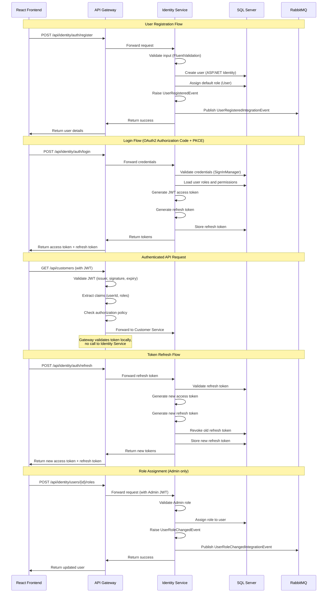

I have created the following plan after thorough exploration and analysis of the codebase. Follow the below plan verbatim. Trust the files and references. Do not re-verify what's written in the plan. Explore only when absolutely necessary. First implement all the proposed file changes and then I'll review all the changes together at the end.

## Observations

The existing codebase follows a well-structured microservices architecture with shared BuildingBlocks libraries. The API Gateway is configured with YARP and expects JWT tokens from the Identity Service at `http://identity-service` (port 5001 in development). The system uses Entity Framework Core 10.0.2, MediatR for domain events, and follows DDD patterns with `Entity<TId>`, `AggregateRoot<TId>`, and `BaseDbContext`. Infrastructure includes SQL Server, RabbitMQ, Redis, Seq for logging, and Jaeger for tracing. Authorization policies are already defined for roles: Admin, Accountant, User, and Viewer.

## Approach

The Identity Service will be implemented as a standalone microservice using ASP.NET Core Identity combined with OpenIddict (free, open-source OAuth2/OIDC framework compatible with .NET 10). This approach provides full OAuth2 and OpenID Connect support without licensing costs while maintaining enterprise-grade security. The service will follow the established patterns from BuildingBlocks, use the same infrastructure (SQL Server, RabbitMQ), and integrate seamlessly with the API Gateway's JWT authentication. The implementation will use Authorization Code Flow with PKCE for web clients and Client Credentials Flow for service-to-service communication.

## Implementation Steps

### 1. Project Structure Setup

Create the Identity Service project structure under `file:src/Services/Identity/`:

```
src/Services/Identity/
├── Identity.API/                    # Web API project
├── Identity.Application/            # Application layer (CQRS, handlers)
├── Identity.Domain/                 # Domain entities and logic
└── Identity.Infrastructure/         # Data access and external services
```

**Create the following projects:**
- `Identity.API` - ASP.NET Core Web API project
- `Identity.Application` - Class library for application logic
- `Identity.Domain` - Class library for domain entities
- `Identity.Infrastructure` - Class library for infrastructure concerns

Add project references:
- `Identity.API` → references `Identity.Application`, `Identity.Infrastructure`
- `Identity.Application` → references `Identity.Domain`, `BuildingBlocks.Common`, `BuildingBlocks.EventBus`
- `Identity.Infrastructure` → references `Identity.Domain`, `BuildingBlocks.Infrastructure`
- `Identity.Domain` → references `BuildingBlocks.Common`

### 2. Domain Layer Implementation

**In `file:src/Services/Identity/Identity.Domain/`:**

Create domain entities that extend the base classes from `BuildingBlocks.Common.Entities`:

- **`ApplicationUser`** - Extends `AggregateRoot<Guid>` and integrates with ASP.NET Core Identity
  - Properties: Email, UserName, FirstName, LastName, PhoneNumber, IsActive, EmailConfirmed, PhoneNumberConfirmed, TwoFactorEnabled, LockoutEnd, AccessFailedCount
  - Implement `IAuditableEntity` for audit tracking
  - Implement `ISoftDeletable` for soft delete support
  - Add domain events: `UserRegisteredEvent`, `UserActivatedEvent`, `UserDeactivatedEvent`, `UserRoleChangedEvent`

- **`ApplicationRole`** - Extends `Entity<Guid>`
  - Properties: Name, NormalizedName, Description, Permissions (JSON column for claim-based permissions)
  - Predefined roles: Admin, Accountant, User, Viewer

- **`RefreshToken`** - Extends `Entity<Guid>`
  - Properties: UserId, Token, ExpiresAt, CreatedAt, RevokedAt, ReplacedByToken
  - Methods: `IsExpired()`, `IsActive()`, `Revoke()`

- **`UserPermission`** - Value object for permissions
  - Predefined permissions: `invoice.create`, `invoice.edit`, `invoice.delete`, `payment.approve`, `reports.view`, `users.manage`, etc.

Create domain events in `file:src/Services/Identity/Identity.Domain/Events/`:
- `UserRegisteredEvent` - Published when a new user registers
- `UserActivatedEvent` - Published when a user is activated
- `UserDeactivatedEvent` - Published when a user is deactivated
- `UserRoleChangedEvent` - Published when user roles change
- `PasswordResetRequestedEvent` - Published when password reset is requested

### 3. Infrastructure Layer Implementation

**In `file:src/Services/Identity/Identity.Infrastructure/`:**

Create `IdentityDbContext` that extends `BaseDbContext`:
- Configure ASP.NET Core Identity entities (ApplicationUser, ApplicationRole, IdentityUserRole, IdentityUserClaim, etc.)
- Add DbSet for RefreshToken
- Apply entity configurations using Fluent API
- Configure indexes on Email, UserName, and Token fields
- Set up cascade delete rules

Create Entity Framework configurations in `file:src/Services/Identity/Identity.Infrastructure/Persistence/Configurations/`:
- `ApplicationUserConfiguration` - Configure user entity, indexes, and relationships
- `ApplicationRoleConfiguration` - Configure role entity and permissions JSON column
- `RefreshTokenConfiguration` - Configure refresh token entity with indexes

Implement repositories in `file:src/Services/Identity/Identity.Infrastructure/Repositories/`:
- `UserRepository` - Extends `Repository<ApplicationUser, Guid>` from BuildingBlocks
  - Methods: `GetByEmailAsync()`, `GetByUserNameAsync()`, `GetActiveUsersAsync()`, `SearchUsersAsync()`
- `RefreshTokenRepository` - Extends `Repository<RefreshToken, Guid>`
  - Methods: `GetByTokenAsync()`, `GetActiveTokensByUserIdAsync()`, `RevokeAllUserTokensAsync()`

Implement services in `file:src/Services/Identity/Identity.Infrastructure/Services/`:
- `CurrentUserService` - Implements `ICurrentUserService` from BuildingBlocks.Common
  - Extract user information from HttpContext claims
- `DateTimeService` - Implements `IDateTime` from BuildingBlocks.Common
  - Provide current UTC and local time
- `TokenService` - Generate and validate JWT tokens
  - Methods: `GenerateAccessToken()`, `GenerateRefreshToken()`, `ValidateToken()`
  - Use symmetric key from configuration (align with API Gateway settings)
  - Set issuer to `http://identity-service` and audience to `accounting-api`

Create database migrations in `file:src/Services/Identity/Identity.Infrastructure/Migrations/`:
- Initial migration with Identity tables, ApplicationUser, ApplicationRole, RefreshToken

### 4. Application Layer Implementation

**In `file:src/Services/Identity/Identity.Application/`:**

Implement CQRS pattern using MediatR:

**Commands** in `file:src/Services/Identity/Identity.Application/Commands/`:
- `RegisterUserCommand` - Register new user
  - Handler: Validate input, create user with ASP.NET Core Identity UserManager, assign default role (User), publish `UserRegisteredEvent`
- `LoginCommand` - Authenticate user
  - Handler: Validate credentials with SignInManager, generate JWT access token and refresh token, return tokens
- `RefreshTokenCommand` - Refresh access token
  - Handler: Validate refresh token, generate new access token and refresh token, revoke old refresh token
- `ChangePasswordCommand` - Change user password
  - Handler: Validate old password, update to new password using UserManager
- `RequestPasswordResetCommand` - Request password reset
  - Handler: Generate password reset token, publish `PasswordResetRequestedEvent` (for email service to handle)
- `ResetPasswordCommand` - Reset password with token
  - Handler: Validate reset token, update password
- `AssignRoleCommand` - Assign role to user
  - Handler: Add user to role, publish `UserRoleChangedEvent`
- `RemoveRoleCommand` - Remove role from user
  - Handler: Remove user from role, publish `UserRoleChangedEvent`
- `ActivateUserCommand` - Activate user account
  - Handler: Set IsActive to true, publish `UserActivatedEvent`
- `DeactivateUserCommand` - Deactivate user account
  - Handler: Set IsActive to false, revoke all refresh tokens, publish `UserDeactivatedEvent`

**Queries** in `file:src/Services/Identity/Identity.Application/Queries/`:
- `GetUserByIdQuery` - Get user by ID
- `GetUserByEmailQuery` - Get user by email
- `GetAllUsersQuery` - Get all users with pagination
- `GetUserRolesQuery` - Get roles for a user
- `GetUserPermissionsQuery` - Get permissions for a user (aggregated from roles)
- `SearchUsersQuery` - Search users by name, email, or role

**DTOs** in `file:src/Services/Identity/Identity.Application/DTOs/`:
- `UserDto` - User information (Id, Email, UserName, FirstName, LastName, Roles, IsActive)
- `LoginRequestDto` - Login credentials (Email/UserName, Password)
- `LoginResponseDto` - Login result (AccessToken, RefreshToken, ExpiresIn, TokenType, User)
- `RegisterRequestDto` - Registration data (Email, UserName, Password, FirstName, LastName, PhoneNumber)
- `ChangePasswordRequestDto` - Password change (OldPassword, NewPassword)
- `ResetPasswordRequestDto` - Password reset (Email, Token, NewPassword)
- `TokenResponseDto` - Token information (AccessToken, RefreshToken, ExpiresIn)

**Validators** in `file:src/Services/Identity/Identity.Application/Validators/`:
- Use FluentValidation for all command and query validation
- `RegisterUserCommandValidator` - Validate email format, password strength (min 8 chars, uppercase, lowercase, digit, special char), required fields
- `LoginCommandValidator` - Validate required fields
- `ChangePasswordCommandValidator` - Validate password strength
- `ResetPasswordCommandValidator` - Validate token and new password

**Event Handlers** in `file:src/Services/Identity/Identity.Application/EventHandlers/`:
- `UserRegisteredEventHandler` - Handle user registration (publish integration event to RabbitMQ)
- `UserRoleChangedEventHandler` - Handle role changes (publish integration event)
- `PasswordResetRequestedEventHandler` - Handle password reset request (publish integration event for email service)

**Integration Events** in `file:src/Services/Identity/Identity.Application/IntegrationEvents/`:
- `UserRegisteredIntegrationEvent` - Extends `IntegrationEvent` from BuildingBlocks.EventBus
- `UserRoleChangedIntegrationEvent`
- `PasswordResetRequestedIntegrationEvent`
- `UserActivatedIntegrationEvent`
- `UserDeactivatedIntegrationEvent`

### 5. API Layer Implementation

**In `file:src/Services/Identity/Identity.API/`:**

Create controllers in `file:src/Services/Identity/Identity.API/Controllers/`:

- **`AuthController`** - Authentication endpoints
  - `POST /api/auth/register` - Register new user (anonymous access)
  - `POST /api/auth/login` - Login (anonymous access)
  - `POST /api/auth/refresh` - Refresh token (anonymous access)
  - `POST /api/auth/logout` - Logout (authenticated)
  - `POST /api/auth/change-password` - Change password (authenticated)
  - `POST /api/auth/request-password-reset` - Request password reset (anonymous)
  - `POST /api/auth/reset-password` - Reset password with token (anonymous)

- **`UsersController`** - User management endpoints
  - `GET /api/users` - Get all users with pagination (Admin only)
  - `GET /api/users/{id}` - Get user by ID (Admin, Accountant, or self)
  - `GET /api/users/me` - Get current user (authenticated)
  - `PUT /api/users/{id}` - Update user (Admin or self)
  - `DELETE /api/users/{id}` - Soft delete user (Admin only)
  - `POST /api/users/{id}/activate` - Activate user (Admin only)
  - `POST /api/users/{id}/deactivate` - Deactivate user (Admin only)
  - `GET /api/users/search` - Search users (Admin, Accountant)

- **`RolesController`** - Role management endpoints
  - `GET /api/roles` - Get all roles (Admin only)
  - `POST /api/roles` - Create role (Admin only)
  - `PUT /api/roles/{id}` - Update role (Admin only)
  - `DELETE /api/roles/{id}` - Delete role (Admin only)
  - `POST /api/users/{userId}/roles` - Assign role to user (Admin only)
  - `DELETE /api/users/{userId}/roles/{roleId}` - Remove role from user (Admin only)
  - `GET /api/users/{userId}/roles` - Get user roles (Admin, Accountant, or self)

Create `file:src/Services/Identity/Identity.API/Program.cs`:
- Configure Serilog with Seq integration (similar to API Gateway)
- Add ASP.NET Core Identity with custom ApplicationUser and ApplicationRole
- Configure OpenIddict server with:
  - Authorization Code Flow with PKCE enabled
  - Client Credentials Flow enabled
  - Refresh Token Flow enabled
  - Token endpoint, authorization endpoint, userinfo endpoint
  - JWT token format with symmetric signing key (matching API Gateway configuration)
  - Token lifetime: Access token 1 hour, Refresh token 7 days
- Add authentication with JWT Bearer (for API endpoints)
- Add authorization policies (Admin, Accountant, User, Viewer)
- Configure Entity Framework Core with SQL Server
- Add MediatR for CQRS
- Add FluentValidation
- Add RabbitMQ event bus from BuildingBlocks
- Add health checks (database, RabbitMQ)
- Add CORS (allow API Gateway origin)
- Add Swagger/OpenAPI with OAuth2 configuration
- Configure OpenTelemetry with Jaeger

Create `file:src/Services/Identity/Identity.API/appsettings.json`:
- ConnectionStrings: DefaultConnection (SQL Server)
- OpenIddict configuration (issuer, token lifetimes, signing key)
- JWT settings (issuer, audience, signing key - must match API Gateway)
- RabbitMQ connection settings
- Serilog configuration with Seq endpoint
- OpenTelemetry configuration with Jaeger endpoint
- CORS allowed origins
- Email settings (for password reset emails - placeholder for future email service)

Create `file:src/Services/Identity/Identity.API/appsettings.Development.json`:
- Override connection strings for local development
- Development-specific settings

Create `file:src/Services/Identity/Identity.API/appsettings.Production.json`:
- Production connection strings (use environment variables)
- Production security settings (HTTPS required, secure cookies)

Create middleware in `file:src/Services/Identity/Identity.API/Middleware/`:
- `ExceptionHandlingMiddleware` - Global exception handling, return consistent error responses using `ErrorDetails` from BuildingBlocks.Common
- `CorrelationIdMiddleware` - Add correlation ID to logs (similar to API Gateway)

Create extensions in `file:src/Services/Identity/Identity.API/Extensions/`:
- `ServiceCollectionExtensions` - Extension methods for registering services
  - `AddApplicationServices()` - Register MediatR, FluentValidation, AutoMapper
  - `AddInfrastructureServices()` - Register DbContext, repositories, UnitOfWork
  - `AddIdentityServices()` - Register ASP.NET Core Identity with custom user/role
  - `AddOpenIddictServices()` - Register OpenIddict server
  - `AddEventBusServices()` - Register RabbitMQ event bus
- `IdentityDataSeeder` - Seed default roles and admin user
  - Create roles: Admin, Accountant, User, Viewer
  - Create default admin user (email: admin@accounting.com, password from configuration)
  - Assign permissions to roles

### 6. OpenIddict Configuration

**In `file:src/Services/Identity/Identity.API/Extensions/OpenIddictExtensions.cs`:**

Configure OpenIddict server:
- Register OpenIddict core services with Entity Framework Core stores
- Configure server options:
  - Enable authorization endpoint: `/connect/authorize`
  - Enable token endpoint: `/connect/token`
  - Enable userinfo endpoint: `/connect/userinfo`
  - Enable introspection endpoint: `/connect/introspect`
  - Enable logout endpoint: `/connect/logout`
  - Enable authorization code flow with PKCE
  - Enable client credentials flow
  - Enable refresh token flow
  - Set access token lifetime to 1 hour
  - Set refresh token lifetime to 7 days
  - Use JWT format for access tokens
  - Configure signing credentials (symmetric key from configuration)
  - Set issuer to `http://identity-service` (matching API Gateway expectations)
  - Add scopes: `openid`, `profile`, `email`, `accounting-api`, `offline_access`
- Register validation services for token validation
- Disable HTTPS requirement for development (enable in production)

Create OpenIddict client registrations in database seeder:
- **React Frontend Client**:
  - ClientId: `accounting-web-app`
  - Type: Public (no client secret for SPA)
  - Allowed flows: Authorization Code with PKCE
  - Redirect URIs: `http://localhost:3000/callback`, `http://localhost:5173/callback`
  - Post-logout redirect URIs: `http://localhost:3000`, `http://localhost:5173`
  - Allowed scopes: `openid`, `profile`, `email`, `accounting-api`, `offline_access`
- **API Gateway Client** (for service-to-service):
  - ClientId: `accounting-api-gateway`
  - Type: Confidential (with client secret)
  - Allowed flows: Client Credentials
  - Allowed scopes: `accounting-api`
- **Microservices Client** (for inter-service communication):
  - ClientId: `accounting-services`
  - Type: Confidential
  - Allowed flows: Client Credentials
  - Allowed scopes: `accounting-api`

### 7. Docker Configuration

Create `file:src/Services/Identity/Identity.API/Dockerfile`:
```dockerfile
FROM mcr.microsoft.com/dotnet/aspnet:10.0 AS base
WORKDIR /app
EXPOSE 80
EXPOSE 443

FROM mcr.microsoft.com/dotnet/sdk:10.0 AS build
WORKDIR /src
COPY ["src/Services/Identity/Identity.API/Identity.API.csproj", "src/Services/Identity/Identity.API/"]
COPY ["src/Services/Identity/Identity.Application/Identity.Application.csproj", "src/Services/Identity/Identity.Application/"]
COPY ["src/Services/Identity/Identity.Domain/Identity.Domain.csproj", "src/Services/Identity/Identity.Domain/"]
COPY ["src/Services/Identity/Identity.Infrastructure/Identity.Infrastructure.csproj", "src/Services/Identity/Identity.Infrastructure/"]
COPY ["src/BuildingBlocks/Common/BuildingBlocks.Common.csproj", "src/BuildingBlocks/Common/"]
COPY ["src/BuildingBlocks/EventBus/BuildingBlocks.EventBus.csproj", "src/BuildingBlocks/EventBus/"]
COPY ["src/BuildingBlocks/Infrastructure/BuildingBlocks.Infrastructure.csproj", "src/BuildingBlocks/Infrastructure/"]
COPY ["Directory.Build.props", "./"]
COPY ["Directory.Packages.props", "./"]
RUN dotnet restore "src/Services/Identity/Identity.API/Identity.API.csproj"
COPY . .
WORKDIR "/src/src/Services/Identity/Identity.API"
RUN dotnet build "Identity.API.csproj" -c Release -o /app/build

FROM build AS publish
RUN dotnet publish "Identity.API.csproj" -c Release -o /app/publish

FROM base AS final
WORKDIR /app
COPY --from=publish /app/publish .
ENTRYPOINT ["dotnet", "Identity.API.dll"]
```

Update `file:docker-compose.yml` to add Identity Service:
```yaml
identity-service:
  build:
    context: .
    dockerfile: src/Services/Identity/Identity.API/Dockerfile
  container_name: accounting-identity-service
  environment:
    ASPNETCORE_ENVIRONMENT: Production
    ASPNETCORE_URLS: http://+:80
    ConnectionStrings__DefaultConnection: Server=sqlserver;Database=IdentityDb;User Id=sa;Password=YourStrong@Passw0rd;TrustServerCertificate=True
    OpenIddict__Issuer: http://identity-service
    OpenIddict__SigningKey: your-secret-key-here-change-in-production
    JWT__Issuer: http://identity-service
    JWT__Audience: accounting-api
    JWT__SigningKey: your-secret-key-here-change-in-production
    RabbitMQ__HostName: rabbitmq
    RabbitMQ__UserName: guest
    RabbitMQ__Password: guest
    Serilog__WriteTo__0__Args__serverUrl: http://seq:5341
    OpenTelemetry__Jaeger__Endpoint: http://jaeger:14268/api/traces
  ports:
    - "5001:80"
  networks:
    - accounting-network
  depends_on:
    sqlserver:
      condition: service_healthy
    rabbitmq:
      condition: service_healthy
    seq:
      condition: service_healthy
    jaeger:
      condition: service_healthy
  healthcheck:
    test: ["CMD", "curl", "-f", "http://localhost/health"]
    interval: 30s
    timeout: 10s
    retries: 3
    start_period: 30s
  restart: unless-stopped
```

### 8. NuGet Package Configuration

Update `file:Directory.Packages.props` to add Identity and OpenIddict packages:
```xml
<!-- Identity packages -->
<PackageVersion Include="Microsoft.AspNetCore.Identity.EntityFrameworkCore" Version="10.0.2" />
<PackageVersion Include="OpenIddict.AspNetCore" Version="5.9.0" />
<PackageVersion Include="OpenIddict.EntityFrameworkCore" Version="5.9.0" />
<PackageVersion Include="System.IdentityModel.Tokens.Jwt" Version="8.3.1" />
<PackageVersion Include="AutoMapper" Version="13.0.1" />
<PackageVersion Include="AutoMapper.Extensions.Microsoft.DependencyInjection" Version="13.0.3" />
```

### 9. Database Migrations and Seeding

Create initial migration in `file:src/Services/Identity/Identity.Infrastructure/`:
- Run: `dotnet ef migrations add InitialCreate --project Identity.Infrastructure --startup-project Identity.API`
- This creates tables for ASP.NET Core Identity, OpenIddict, and custom entities

Create database seeder in `file:src/Services/Identity/Identity.API/Data/IdentityDataSeeder.cs`:
- Seed default roles with permissions:
  - **Admin**: All permissions
  - **Accountant**: invoice.*, payment.*, reports.view, gl.*, ar.*, ap.*
  - **User**: invoice.create, invoice.view, payment.create, payment.view, reports.view
  - **Viewer**: *.view permissions only
- Seed default admin user:
  - Email: admin@accounting.com
  - Password: Admin@123 (from configuration, must be changed on first login)
  - Roles: Admin
- Seed OpenIddict clients (as described in step 6)

Call seeder in `file:src/Services/Identity/Identity.API/Program.cs`:
- After `app.Build()`, create a scope and run seeder
- Apply pending migrations automatically on startup (development only)

### 10. Health Checks

Create health check in `file:src/Services/Identity/Identity.API/HealthChecks/`:
- `IdentityHealthCheck` - Check database connectivity and OpenIddict configuration

Configure health check endpoints in `Program.cs`:
- `/health` - Overall health (ready for traffic)
- `/health/live` - Liveness probe (application is running)
- `/health/ready` - Readiness probe (dependencies are available)

### 11. Integration with API Gateway

The Identity Service is already configured in the API Gateway's `file:src/ApiGateway/appsettings.json`:
- Route: `/api/identity/{**catch-all}` → `http://identity-service`
- Health check configured
- Service discovery configured

Verify JWT token configuration matches between:
- `file:src/Services/Identity/Identity.API/appsettings.json` (issuer, signing key)
- `file:src/ApiGateway/appsettings.json` (ValidIssuer, IssuerSigningKey)

### 12. Testing and Validation

Create integration tests in `file:src/Services/Identity/Identity.API.Tests/`:
- Test user registration flow
- Test login flow (valid credentials, invalid credentials)
- Test token refresh flow
- Test password reset flow
- Test role assignment
- Test authorization policies
- Test OpenIddict endpoints (authorization, token, userinfo)

Create unit tests in `file:src/Services/Identity/Identity.Application.Tests/`:
- Test command handlers
- Test query handlers
- Test validators
- Test domain events

### 13. Documentation

Create `file:src/Services/Identity/README.md`:
- Service overview and responsibilities
- Architecture diagram
- API endpoints documentation
- OAuth2/OIDC flows supported
- Client registration guide
- Environment variables reference
- Database schema overview
- Development setup instructions
- Testing instructions

## Architecture Diagram



## Security Considerations

| Aspect | Implementation |
|--------|----------------|
| **Password Storage** | ASP.NET Core Identity with PBKDF2 hashing (default) |
| **Token Security** | JWT with symmetric signing (HS256), 1-hour expiry for access tokens |
| **Refresh Tokens** | Stored in database, single-use, 7-day expiry, revocable |
| **PKCE** | Required for Authorization Code flow (public clients) |
| **HTTPS** | Required in production (enforced via middleware) |
| **Rate Limiting** | Configured in API Gateway (20 requests/minute for auth endpoints) |
| **Account Lockout** | Enabled after 5 failed login attempts, 15-minute lockout |
| **Token Revocation** | Refresh tokens can be revoked, access tokens expire naturally |
| **CORS** | Restricted to configured frontend origins only |
| **Secrets Management** | Use environment variables in production, never commit secrets |

## Role-Permission Matrix

| Role | Permissions |
|------|-------------|
| **Admin** | All permissions (users.*, invoice.*, payment.*, reports.*, gl.*, ar.*, ap.*, products.*, customers.*) |
| **Accountant** | invoice.*, payment.*, reports.view, gl.*, ar.*, ap.*, customers.view, products.view |
| **User** | invoice.create, invoice.view, invoice.edit (own), payment.create, payment.view, reports.view, customers.view, products.view |
| **Viewer** | *.view (read-only access to all resources) |

## Environment Variables Reference

| Variable | Description | Example |
|----------|-------------|---------|
| `ConnectionStrings__DefaultConnection` | SQL Server connection string | `Server=sqlserver;Database=IdentityDb;...` |
| `OpenIddict__Issuer` | Token issuer URL | `http://identity-service` |
| `OpenIddict__SigningKey` | Symmetric signing key (min 32 chars) | `your-secret-key-here-change-in-production` |
| `JWT__Audience` | Token audience | `accounting-api` |
| `RabbitMQ__HostName` | RabbitMQ host | `rabbitmq` |
| `Serilog__WriteTo__0__Args__serverUrl` | Seq logging endpoint | `http://seq:5341` |
| `OpenTelemetry__Jaeger__Endpoint` | Jaeger tracing endpoint | `http://jaeger:14268/api/traces` |
| `AdminUser__Email` | Default admin email | `admin@accounting.com` |
| `AdminUser__Password` | Default admin password | `Admin@123` (change immediately) |