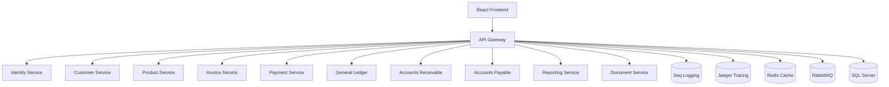

# API Gateway

The API Gateway serves as the single entry point for all client applications accessing the Accounting System microservices. Built with YARP (Yet Another Reverse Proxy), it provides routing, load balancing, authentication, rate limiting, and request aggregation capabilities.

## Overview

The API Gateway implements the following key features:

- **Reverse Proxy**: Routes requests to appropriate microservices using YARP
- **Rate Limiting**: Protects services from abuse with configurable limits
- **Authentication & Authorization**: JWT token validation and role-based access control
- **CORS**: Configurable cross-origin resource sharing for frontend applications
- **Health Checks**: Monitors downstream services and infrastructure health
- **Request Aggregation**: Backend-for-Frontend (BFF) pattern implementation
- **Service Discovery**: Dynamic service resolution for development and production
- **Observability**: Distributed tracing with OpenTelemetry and Jaeger, structured logging with Serilog and Seq

## Architecture



## Service Routing

| Route Pattern | Target Service | Description |
|--------------|----------------|-------------|
| `/api/identity/**` | Identity Service | Authentication, user management |
| `/api/customers/**` | Customer Service | Customer and vendor management |
| `/api/products/**` | Product Service | Product catalog and pricing |
| `/api/invoices/**` | Invoice Service | Invoice creation and management |
| `/api/payments/**` | Payment Service | Payment recording and tracking |
| `/api/gl/**` | General Ledger Service | Chart of accounts, journal entries |
| `/api/ar/**` | Accounts Receivable Service | Customer balances, aging reports |
| `/api/ap/**` | Accounts Payable Service | Vendor bills, payables |
| `/api/reports/**` | Reporting Service | Financial reports and analytics |
| `/api/documents/**` | Document Service | Document generation (PDF, Excel, HTML) |
| `/api/bff/**` | Aggregation Endpoints | Backend for Frontend aggregations |
| `/health` | API Gateway | Overall health status |
| `/health/ready` | API Gateway | Readiness probe |
| `/health/live` | API Gateway | Liveness probe |

## Rate Limiting Policies

| Policy | Limit | Window | Partition By |
|--------|-------|--------|--------------|
| Global | 100 requests | 1 minute | IP Address |
| Authentication | 20 requests | 1 minute | IP Address |
| API (Authenticated) | 1000 requests | 1 hour | User ID |
| Reporting | 5 concurrent | N/A | User ID |

## Authentication & Authorization

### JWT Configuration
- **Issuer**: Identity Service URL
- **Audience**: `accounting-api`
- **Signing Key**: Shared secret (change in production)
- **Validation**: Issuer, Audience, Lifetime, Signature

### Authorization Policies
- **AdminOnly**: Admin role required
- **AccountantOnly**: Admin or Accountant roles
- **UserAccess**: Admin, Accountant, or User roles
- **ViewerAccess**: All authenticated users
- **CanCreateInvoice**: `invoice.create` claim required
- **CanApprovePayments**: `payment.approve` claim required
- **CanViewReports**: `reports.view` claim required
- **CanManageUsers**: `users.manage` claim required

## Request Aggregation (BFF Pattern)

The API Gateway provides aggregation endpoints that combine data from multiple services:

### Dashboard Aggregation
```
GET /api/bff/dashboard
```
Aggregates:
- Customer statistics
- Invoice statistics
- Payment statistics
- General Ledger summary

### Invoice Details Aggregation
```
GET /api/bff/invoice-details?id={invoiceId}
```
Aggregates:
- Invoice data
- Customer information
- Product details
- Payment history

## Health Checks

### Endpoints
- `/health` - Overall health status
- `/health/ready` - Readiness for load balancer
- `/health/live` - Liveness for container orchestration

### Monitored Services
- SQL Server database connectivity
- RabbitMQ message broker
- Redis cache
- All downstream microservices

## Configuration

### Development
- Local service URLs (localhost with different ports)
- Detailed logging and tracing
- Relaxed CORS and rate limiting

### Production
- Service discovery via Consul/DNS
- Stricter security policies
- Optimized logging levels
- Production CORS origins

## Observability

### Logging
- **Serilog** with structured logging
- **Seq** for centralized log aggregation
- Correlation ID tracking across requests
- Request/response logging

### Distributed Tracing
- **OpenTelemetry** instrumentation
- **Jaeger** for trace visualization
- ASP.NET Core and HTTP client instrumentation
- Custom activity sources for aggregation endpoints

## Local Development Setup

1. **Prerequisites**
   ```bash
   # .NET 10 SDK
   # Docker Desktop
   # Visual Studio 2022 or VS Code
   ```

2. **Start Infrastructure**
   ```bash
   docker-compose up -d sqlserver rabbitmq redis seq jaeger
   ```

3. **Run API Gateway**
   ```bash
   cd src/ApiGateway
   dotnet run
   ```

4. **Access Points**
   - API Gateway: `http://localhost:5000`
   - Health Checks: `http://localhost:5000/health`
   - Seq Logging: `http://localhost:5341`
   - Jaeger Tracing: `http://localhost:16686`

## Docker Deployment

```bash
# Build and run
docker build -t accounting-apigateway .
docker run -p 5000:80 accounting-apigateway
```

## Configuration Files

- `appsettings.json` - Base configuration
- `appsettings.Development.json` - Development overrides
- `appsettings.Production.json` - Production overrides
- `Directory.Packages.props` - Centralized package versions

## Troubleshooting

### Common Issues

1. **Service Unavailable**
   - Check downstream service health: `/health`
   - Verify service discovery configuration
   - Check Docker network connectivity

2. **Rate Limiting**
   - Monitor rate limit headers in responses
   - Adjust limits in `appsettings.json`
   - Check IP/user identification

3. **Authentication Failures**
   - Verify JWT token format
   - Check Identity Service connectivity
   - Validate issuer/audience configuration

4. **CORS Issues**
   - Verify allowed origins in configuration
   - Check request headers and preflight requests
   - Ensure credentials are handled correctly

### Logs and Tracing

- **Application Logs**: Check Seq at `http://localhost:5341`
- **Distributed Traces**: Check Jaeger at `http://localhost:16686`
- **Health Status**: Check `/health` endpoint
- **Request Correlation**: Use `X-Correlation-Id` header for tracking

## Security Considerations

- Change default JWT signing key in production
- Use HTTPS in production environments
- Implement proper certificate validation
- Configure firewall rules for service communication
- Regular security updates for all dependencies
- Implement proper secrets management (Azure Key Vault, AWS Secrets Manager, etc.)

## Performance Optimization

- Configure appropriate rate limits based on load testing
- Implement response caching where appropriate
- Use connection pooling for downstream services
- Configure timeouts appropriately
- Monitor and optimize health check intervals
- Use async/await patterns throughout the pipeline