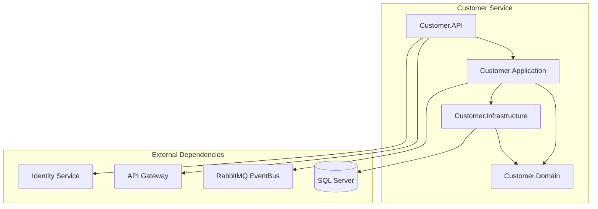
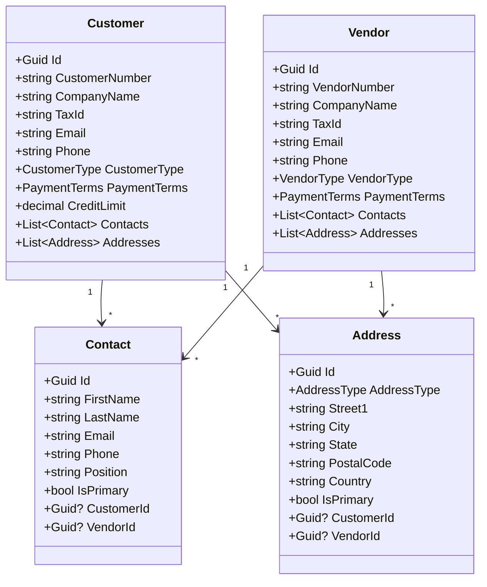
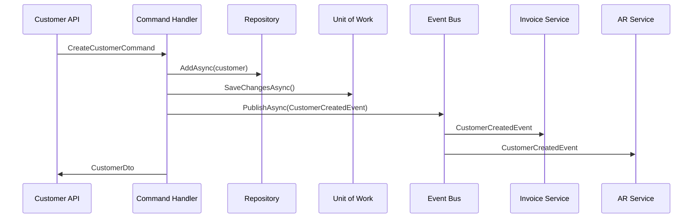

I have created the following plan after thorough exploration and analysis of the codebase. Follow the below plan verbatim. Trust the files and references. Do not re-verify what's written in the plan. Explore only when absolutely necessary. First implement all the proposed file changes and then I'll review all the changes together at the end.

## Key Observations

The accounting system follows Clean Architecture with a well-established pattern across all microservices. The Identity Service demonstrates the standard structure: Domain layer with aggregate roots and value objects, Application layer with CQRS (Commands/Queries via MediatR), Infrastructure layer with EF Core repositories and DbContext, and API layer with controllers. All entities implement `IAuditableEntity` and `ISoftDeletable` from BuildingBlocks.Common. Integration events are published via RabbitMQ using the `IEventBus` abstraction. The system uses JWT authentication, FluentValidation, and is fully containerized with Docker.

## Approach

The Customer Service will mirror the Identity Service architecture exactly, ensuring consistency across microservices. We'll create four projects following Clean Architecture: Domain (entities and events), Application (CQRS handlers, DTOs, validators), Infrastructure (DbContext, repositories, EF Core configurations), and API (controllers, Program.cs). The service will manage both customers and vendors as separate aggregate roots with associated contacts and addresses as value objects or child entities. Integration events will be published for customer/vendor lifecycle changes to enable other services (Invoice, AR, AP) to react. The service will be fully integrated with the existing infrastructure (RabbitMQ, SQL Server, API Gateway, authentication).

## Implementation Steps

### 1. Create Customer Service Project Structure

Create the four-layer Clean Architecture structure for the Customer Service:

**Domain Layer** - `file:src/Services/Customer/Customer.Domain/Customer.Domain.csproj`
- Reference `file:src/BuildingBlocks/Common/BuildingBlocks.Common.csproj`
- Create `Entities` folder for domain entities
- Create `ValueObjects` folder for value objects
- Create `Events` folder for domain events
- Create `Enums` folder for domain enumerations

**Application Layer** - `file:src/Services/Customer/Customer.Application/Customer.Application.csproj`
- Reference Customer.Domain project
- Reference `file:src/BuildingBlocks/Common/BuildingBlocks.Common.csproj`
- Reference `file:src/BuildingBlocks/EventBus/BuildingBlocks.EventBus.csproj`
- Add NuGet packages: MediatR, FluentValidation, AutoMapper
- Create folders: `Commands`, `Queries`, `Handlers`, `DTOs`, `Validators`, `IntegrationEvents`

**Infrastructure Layer** - `file:src/Services/Customer/Customer.Infrastructure/Customer.Infrastructure.csproj`
- Reference Customer.Domain and Customer.Application projects
- Reference `file:src/BuildingBlocks/Infrastructure/BuildingBlocks.Infrastructure.csproj`
- Add NuGet packages: Microsoft.EntityFrameworkCore.SqlServer, Microsoft.EntityFrameworkCore.Tools
- Create folders: `Persistence`, `Repositories`, `Configurations`

**API Layer** - `file:src/Services/Customer/Customer.API/Customer.API.csproj`
- Reference Customer.Application and Customer.Infrastructure projects
- Add NuGet packages: Serilog, Swashbuckle.AspNetCore, Microsoft.AspNetCore.Authentication.JwtBearer
- Create folders: `Controllers`, `Properties`
- Create files: `Program.cs`, `appsettings.json`, `appsettings.Development.json`, `Dockerfile`

### 2. Implement Domain Entities and Value Objects

**Customer Aggregate Root** - `file:src/Services/Customer/Customer.Domain/Entities/Customer.cs`
- Inherit from `AggregateRoot<Guid>`
- Implement `IAuditableEntity` and `ISoftDeletable` interfaces
- Properties: CustomerNumber (unique), CompanyName, TaxId, Email, Phone, Website, CustomerType (enum), PaymentTerms, CreditLimit, Notes
- Navigation properties: List of Contacts, List of Addresses
- Business methods: AddContact(), RemoveContact(), AddAddress(), RemoveAddress(), UpdateCreditLimit()
- Domain events: CustomerCreated, CustomerUpdated, CustomerDeleted, CreditLimitChanged

**Vendor Aggregate Root** - `file:src/Services/Customer/Customer.Domain/Entities/Vendor.cs`
- Inherit from `AggregateRoot<Guid>`
- Implement `IAuditableEntity` and `ISoftDeletable` interfaces
- Properties: VendorNumber (unique), CompanyName, TaxId, Email, Phone, Website, VendorType (enum), PaymentTerms, Notes
- Navigation properties: List of Contacts, List of Addresses
- Business methods: AddContact(), RemoveContact(), AddAddress(), RemoveAddress()
- Domain events: VendorCreated, VendorUpdated, VendorDeleted

**Contact Entity** - `file:src/Services/Customer/Customer.Domain/Entities/Contact.cs`
- Inherit from `Entity<Guid>`
- Implement `IAuditableEntity` and `ISoftDeletable` interfaces
- Properties: FirstName, LastName, Email, Phone, Mobile, Position, IsPrimary, CustomerId (nullable), VendorId (nullable)
- Foreign key relationships to Customer and Vendor

**Address Entity** - `file:src/Services/Customer/Customer.Domain/Entities/Address.cs`
- Inherit from `Entity<Guid>`
- Implement `IAuditableEntity` and `ISoftDeletable` interfaces
- Properties: AddressType (enum: Billing, Shipping, Both), Street1, Street2, City, State, PostalCode, Country, IsPrimary, CustomerId (nullable), VendorId (nullable)
- Foreign key relationships to Customer and Vendor

**Enumerations** - `file:src/Services/Customer/Customer.Domain/Enums/`
- `CustomerType`: Individual, Business, Government, NonProfit
- `VendorType`: Supplier, Contractor, Service, Utility
- `AddressType`: Billing, Shipping, Both
- `PaymentTerms`: Net15, Net30, Net45, Net60, Net90, DueOnReceipt, Custom

**Domain Events** - `file:src/Services/Customer/Customer.Domain/Events/`
- `CustomerCreatedEvent`: CustomerId, CompanyName, Email
- `CustomerUpdatedEvent`: CustomerId, CompanyName
- `CustomerDeletedEvent`: CustomerId
- `VendorCreatedEvent`: VendorId, CompanyName, Email
- `VendorUpdatedEvent`: VendorId, CompanyName
- `VendorDeletedEvent`: VendorId
- All inherit from `INotification` (MediatR)

### 3. Implement Application Layer - DTOs

Create DTOs in `file:src/Services/Customer/Customer.Application/DTOs/`:

**Customer DTOs**:
- `CustomerDto`: Id, CustomerNumber, CompanyName, TaxId, Email, Phone, Website, CustomerType, PaymentTerms, CreditLimit, Notes, Contacts (List<ContactDto>), Addresses (List<AddressDto>), CreatedAt, LastModifiedAt
- `CreateCustomerDto`: CompanyName, TaxId, Email, Phone, Website, CustomerType, PaymentTerms, CreditLimit, Notes
- `UpdateCustomerDto`: CompanyName, TaxId, Email, Phone, Website, CustomerType, PaymentTerms, CreditLimit, Notes

**Vendor DTOs**:
- `VendorDto`: Id, VendorNumber, CompanyName, TaxId, Email, Phone, Website, VendorType, PaymentTerms, Notes, Contacts (List<ContactDto>), Addresses (List<AddressDto>), CreatedAt, LastModifiedAt
- `CreateVendorDto`: CompanyName, TaxId, Email, Phone, Website, VendorType, PaymentTerms, Notes
- `UpdateVendorDto`: CompanyName, TaxId, Email, Phone, Website, VendorType, PaymentTerms, Notes

**Contact DTOs**:
- `ContactDto`: Id, FirstName, LastName, Email, Phone, Mobile, Position, IsPrimary
- `CreateContactDto`: FirstName, LastName, Email, Phone, Mobile, Position, IsPrimary
- `UpdateContactDto`: FirstName, LastName, Email, Phone, Mobile, Position, IsPrimary

**Address DTOs**:
- `AddressDto`: Id, AddressType, Street1, Street2, City, State, PostalCode, Country, IsPrimary
- `CreateAddressDto`: AddressType, Street1, Street2, City, State, PostalCode, Country, IsPrimary
- `UpdateAddressDto`: AddressType, Street1, Street2, City, State, PostalCode, Country, IsPrimary

### 4. Implement Application Layer - Commands

Create commands in `file:src/Services/Customer/Customer.Application/Commands/`:

**Customer Commands**:
- `CreateCustomerCommand`: Implements `IRequest<CustomerDto>`, properties from CreateCustomerDto plus optional Contacts and Addresses lists
- `UpdateCustomerCommand`: Implements `IRequest<CustomerDto>`, includes CustomerId and properties from UpdateCustomerDto
- `DeleteCustomerCommand`: Implements `IRequest<bool>`, includes CustomerId
- `AddContactToCustomerCommand`: Implements `IRequest<CustomerDto>`, includes CustomerId and CreateContactDto
- `RemoveContactFromCustomerCommand`: Implements `IRequest<CustomerDto>`, includes CustomerId and ContactId
- `AddAddressToCustomerCommand`: Implements `IRequest<CustomerDto>`, includes CustomerId and CreateAddressDto
- `RemoveAddressFromCustomerCommand`: Implements `IRequest<CustomerDto>`, includes CustomerId and AddressId
- `UpdateCreditLimitCommand`: Implements `IRequest<CustomerDto>`, includes CustomerId and NewCreditLimit

**Vendor Commands**:
- `CreateVendorCommand`: Implements `IRequest<VendorDto>`, properties from CreateVendorDto plus optional Contacts and Addresses lists
- `UpdateVendorCommand`: Implements `IRequest<VendorDto>`, includes VendorId and properties from UpdateVendorDto
- `DeleteVendorCommand`: Implements `IRequest<bool>`, includes VendorId
- `AddContactToVendorCommand`: Implements `IRequest<VendorDto>`, includes VendorId and CreateContactDto
- `RemoveContactFromVendorCommand`: Implements `IRequest<VendorDto>`, includes VendorId and ContactId
- `AddAddressToVendorCommand`: Implements `IRequest<VendorDto>`, includes VendorId and CreateAddressDto
- `RemoveAddressFromVendorCommand`: Implements `IRequest<VendorDto>`, includes VendorId and AddressId

### 5. Implement Application Layer - Queries

Create queries in `file:src/Services/Customer/Customer.Application/Queries/`:

**Customer Queries**:
- `GetCustomerByIdQuery`: Implements `IRequest<CustomerDto?>`, includes CustomerId
- `GetAllCustomersQuery`: Implements `IRequest<PagedResult<CustomerDto>>`, includes PageNumber, PageSize, SearchTerm (optional), CustomerType (optional)
- `GetCustomerByNumberQuery`: Implements `IRequest<CustomerDto?>`, includes CustomerNumber
- `GetCustomerByEmailQuery`: Implements `IRequest<CustomerDto?>`, includes Email
- `SearchCustomersQuery`: Implements `IRequest<List<CustomerDto>>`, includes SearchTerm, PageNumber, PageSize

**Vendor Queries**:
- `GetVendorByIdQuery`: Implements `IRequest<VendorDto?>`, includes VendorId
- `GetAllVendorsQuery`: Implements `IRequest<PagedResult<VendorDto>>`, includes PageNumber, PageSize, SearchTerm (optional), VendorType (optional)
- `GetVendorByNumberQuery`: Implements `IRequest<VendorDto?>`, includes VendorNumber
- `GetVendorByEmailQuery`: Implements `IRequest<VendorDto?>`, includes Email
- `SearchVendorsQuery`: Implements `IRequest<List<VendorDto>>`, includes SearchTerm, PageNumber, PageSize

### 6. Implement Application Layer - Command Handlers

Create command handlers in `file:src/Services/Customer/Customer.Application/Handlers/`:

**Customer Command Handlers**:
- `CreateCustomerCommandHandler`: Implements `IRequestHandler<CreateCustomerCommand, CustomerDto>`
  - Inject `ICustomerRepository`, `IUnitOfWork`, `IEventBus`, `ICurrentUserService`
  - Generate unique CustomerNumber (e.g., "CUST-{sequential-number}")
  - Create Customer entity with provided data
  - Add contacts and addresses if provided
  - Save to repository via UnitOfWork
  - Publish `CustomerCreatedIntegrationEvent` via IEventBus
  - Return CustomerDto

- `UpdateCustomerCommandHandler`: Implements `IRequestHandler<UpdateCustomerCommand, CustomerDto>`
  - Retrieve customer by Id, throw NotFoundException if not found
  - Update customer properties
  - Save via UnitOfWork
  - Publish `CustomerUpdatedIntegrationEvent`
  - Return CustomerDto

- `DeleteCustomerCommandHandler`: Implements `IRequestHandler<DeleteCustomerCommand, bool>`
  - Retrieve customer by Id
  - Perform soft delete (set IsDeleted = true, DeletedAt = DateTime.UtcNow)
  - Save via UnitOfWork
  - Publish `CustomerDeletedIntegrationEvent`
  - Return true

- `AddContactToCustomerCommandHandler`, `RemoveContactFromCustomerCommandHandler`, `AddAddressToCustomerCommandHandler`, `RemoveAddressFromCustomerCommandHandler`, `UpdateCreditLimitCommandHandler`: Similar pattern

**Vendor Command Handlers**: Mirror customer handlers for vendor operations

### 7. Implement Application Layer - Query Handlers

Create query handlers in `file:src/Services/Customer/Customer.Application/Handlers/`:

**Customer Query Handlers**:
- `GetCustomerByIdQueryHandler`: Implements `IRequestHandler<GetCustomerByIdQuery, CustomerDto?>`
  - Inject `ICustomerRepository`
  - Retrieve customer with includes for Contacts and Addresses
  - Map to CustomerDto using AutoMapper
  - Return CustomerDto or null

- `GetAllCustomersQueryHandler`: Implements `IRequestHandler<GetAllCustomersQuery, PagedResult<CustomerDto>>`
  - Use repository GetPagedAsync with filters
  - Map to PagedResult<CustomerDto>

- `SearchCustomersQueryHandler`, `GetCustomerByNumberQueryHandler`, `GetCustomerByEmailQueryHandler`: Similar pattern

**Vendor Query Handlers**: Mirror customer handlers for vendor operations

### 8. Implement Application Layer - Validators

Create FluentValidation validators in `file:src/Services/Customer/Customer.Application/Validators/`:

**Customer Validators**:
- `CreateCustomerCommandValidator`: 
  - CompanyName: Required, MaxLength(200)
  - TaxId: Optional, MaxLength(50), unique validation
  - Email: Required, EmailAddress, MaxLength(100)
  - Phone: Optional, MaxLength(20)
  - Website: Optional, MaxLength(200), URL format
  - CreditLimit: GreaterThanOrEqualTo(0)

- `UpdateCustomerCommandValidator`: Similar to Create
- `AddContactToCustomerCommandValidator`: Validate contact fields
- `AddAddressToCustomerCommandValidator`: Validate address fields

**Vendor Validators**: Mirror customer validators

### 9. Implement Application Layer - Integration Events

Create integration events in `file:src/Services/Customer/Customer.Application/IntegrationEvents/`:

- `CustomerCreatedIntegrationEvent`: Inherits from `IntegrationEvent`, properties: CustomerId, CustomerNumber, CompanyName, Email, TaxId, PaymentTerms, CreditLimit
- `CustomerUpdatedIntegrationEvent`: CustomerId, CustomerNumber, CompanyName, Email, PaymentTerms, CreditLimit
- `CustomerDeletedIntegrationEvent`: CustomerId, CustomerNumber
- `VendorCreatedIntegrationEvent`: VendorId, VendorNumber, CompanyName, Email, TaxId, PaymentTerms
- `VendorUpdatedIntegrationEvent`: VendorId, VendorNumber, CompanyName, Email, PaymentTerms
- `VendorDeletedIntegrationEvent`: VendorId, VendorNumber

### 10. Implement Infrastructure Layer - DbContext

Create `file:src/Services/Customer/Customer.Infrastructure/Persistence/CustomerDbContext.cs`:
- Inherit from `BaseDbContext` (from BuildingBlocks.Infrastructure)
- DbSet properties: Customers, Vendors, Contacts, Addresses
- Override `OnModelCreating` to configure entities using Fluent API
- Apply entity configurations from separate configuration classes
- Configure audit interceptor and soft delete interceptor from BuildingBlocks

Create entity configurations in `file:src/Services/Customer/Customer.Infrastructure/Configurations/`:
- `CustomerConfiguration`: Configure table name, primary key, indexes (CustomerNumber unique, Email unique), property constraints (MaxLength), relationships with Contacts and Addresses (one-to-many with cascade delete)
- `VendorConfiguration`: Similar to CustomerConfiguration
- `ContactConfiguration`: Configure foreign keys to Customer and Vendor (nullable), indexes
- `AddressConfiguration`: Configure foreign keys, indexes, enum conversions

### 11. Implement Infrastructure Layer - Repositories

Create repositories in `file:src/Services/Customer/Customer.Infrastructure/Repositories/`:

**ICustomerRepository** - `file:src/Services/Customer/Customer.Infrastructure/Repositories/ICustomerRepository.cs`:
- Inherit from `IRepository<Customer, Guid>`
- Additional methods: 
  - `GetByCustomerNumberAsync(string customerNumber)`
  - `GetByEmailAsync(string email)`
  - `GetWithContactsAndAddressesAsync(Guid customerId)`
  - `SearchAsync(string searchTerm, CustomerType? type, int pageNumber, int pageSize)`
  - `IsCustomerNumberUniqueAsync(string customerNumber)`
  - `IsTaxIdUniqueAsync(string taxId)`

**CustomerRepository** - `file:src/Services/Customer/Customer.Infrastructure/Repositories/CustomerRepository.cs`:
- Inherit from `Repository<Customer, Guid>`
- Implement ICustomerRepository
- Use EF Core Include() for eager loading Contacts and Addresses
- Implement search with filtering by CompanyName, Email, CustomerNumber, TaxId

**IVendorRepository and VendorRepository**: Mirror customer repository pattern

**IContactRepository and ContactRepository**: Basic CRUD operations
**IAddressRepository and AddressRepository**: Basic CRUD operations

### 12. Implement API Layer - Controllers

Create controllers in `file:src/Services/Customer/Customer.API/Controllers/`:

**CustomersController** - `file:src/Services/Customer/Customer.API/Controllers/CustomersController.cs`:
- Inherit from `ControllerBase`
- Attributes: `[ApiController]`, `[Route("api/[controller]")]`, `[Authorize]`
- Inject `IMediator` and `ILogger<CustomersController>`
- Endpoints:
  - `GET /api/customers` - GetAll (with pagination, search, filters) - Authorize(Roles = "Admin,Accountant,User")
  - `GET /api/customers/{id}` - GetById - Authorize(Roles = "Admin,Accountant,User")
  - `GET /api/customers/number/{customerNumber}` - GetByNumber
  - `GET /api/customers/search` - Search
  - `POST /api/customers` - Create - Authorize(Roles = "Admin,Accountant")
  - `PUT /api/customers/{id}` - Update - Authorize(Roles = "Admin,Accountant")
  - `DELETE /api/customers/{id}` - Delete (soft delete) - Authorize(Roles = "Admin")
  - `POST /api/customers/{id}/contacts` - AddContact - Authorize(Roles = "Admin,Accountant")
  - `DELETE /api/customers/{id}/contacts/{contactId}` - RemoveContact
  - `POST /api/customers/{id}/addresses` - AddAddress
  - `DELETE /api/customers/{id}/addresses/{addressId}` - RemoveAddress
  - `PUT /api/customers/{id}/credit-limit` - UpdateCreditLimit - Authorize(Roles = "Admin,Accountant")

**VendorsController** - `file:src/Services/Customer/Customer.API/Controllers/VendorsController.cs`:
- Mirror CustomersController structure for vendor operations
- Endpoints: GET /api/vendors, GET /api/vendors/{id}, POST /api/vendors, PUT /api/vendors/{id}, DELETE /api/vendors/{id}, etc.

### 13. Implement API Layer - Program.cs

Create `file:src/Services/Customer/Customer.API/Program.cs`:
- Configure Serilog with Seq integration
- Add DbContext with SQL Server connection string
- Register repositories: `AddScoped<ICustomerRepository, CustomerRepository>`, `AddScoped<IVendorRepository, VendorRepository>`
- Register UnitOfWork: `AddScoped<IUnitOfWork, UnitOfWork<CustomerDbContext>>`
- Register CurrentUserService from BuildingBlocks
- Configure RabbitMQ EventBus using `AddRabbitMQEventBus()` extension from BuildingBlocks.EventBus
- Add MediatR with assembly scanning for handlers
- Add FluentValidation with assembly scanning for validators
- Add AutoMapper with assembly scanning for mapping profiles
- Configure JWT Authentication (same as Identity Service)
- Configure Authorization policies (AdminOnly, AdminOrAccountant, etc.)
- Add CORS policy for frontend
- Add health checks for DbContext and RabbitMQ
- Add Swagger/OpenAPI
- Configure middleware pipeline: HTTPS redirection, CORS, Authentication, Authorization
- Apply EF Core migrations on startup
- Seed initial data if needed (e.g., sample customers/vendors for development)

### 14. Implement API Layer - Configuration Files

**appsettings.json** - `file:src/Services/Customer/Customer.API/appsettings.json`:
```json
{
  "ConnectionStrings": {
    "DefaultConnection": "Server=localhost;Database=CustomerService;User Id=sa;Password=YourStrong@Passw0rd;TrustServerCertificate=True"
  },
  "JWT": {
    "SigningKey": "YourVerySecureSigningKeyThatIsLongerThanThirtyTwoCharactersForHS256Algorithm",
    "Issuer": "IdentityService",
    "Audience": "AccountingSystem"
  },
  "RabbitMQ": {
    "HostName": "localhost",
    "Port": 5672,
    "UserName": "guest",
    "Password": "guest",
    "VirtualHost": "/",
    "ExchangeName": "accounting_exchange",
    "QueueName": "customer_service_queue"
  },
  "Serilog": {
    "MinimumLevel": "Information",
    "WriteTo": [
      { "Name": "Console" },
      { "Name": "Seq", "Args": { "serverUrl": "http://localhost:5341" } }
    ]
  }
}
```

**appsettings.Development.json**: Override with development-specific settings

**Dockerfile** - `file:src/Services/Customer/Customer.API/Dockerfile`:
- Multi-stage build similar to Identity Service Dockerfile
- Base image: mcr.microsoft.com/dotnet/aspnet:8.0
- Build image: mcr.microsoft.com/dotnet/sdk:8.0
- Copy project files, restore dependencies, build, publish
- Expose port 80
- Set entrypoint to Customer.API.dll

### 15. Update Docker Compose Configuration

Update `file:docker-compose.yml`:
- Add `customer-service` service definition
- Build context: `.`, dockerfile: `src/Services/Customer/Customer.API/Dockerfile`
- Environment variables: ASPNETCORE_ENVIRONMENT, ConnectionStrings, JWT settings, RabbitMQ settings, Serilog, OpenTelemetry
- Port mapping: `5002:80`
- Depends on: sqlserver, rabbitmq, seq, jaeger, identity-service
- Health check: `curl -f http://localhost/health`
- Network: accounting-network
- Restart policy: unless-stopped

### 16. Create EF Core Migrations

Create initial migration for Customer Service:
- Navigate to `file:src/Services/Customer/Customer.Infrastructure/`
- Run: `dotnet ef migrations add InitialCreate --startup-project ../Customer.API --context CustomerDbContext`
- Review generated migration files in `Migrations` folder
- Ensure all entities, relationships, indexes, and constraints are properly configured
- Migration will be applied automatically on service startup via `Program.cs`

### 17. Implement AutoMapper Profiles

Create `file:src/Services/Customer/Customer.Application/Mappings/MappingProfile.cs`:
- Inherit from `Profile`
- Configure mappings:
  - `Customer` → `CustomerDto` (include Contacts and Addresses)
  - `CreateCustomerDto` → `Customer`
  - `UpdateCustomerDto` → `Customer`
  - `Vendor` → `VendorDto`
  - `CreateVendorDto` → `Vendor`
  - `UpdateVendorDto` → `Vendor`
  - `Contact` → `ContactDto`
  - `CreateContactDto` → `Contact`
  - `Address` → `AddressDto`
  - `CreateAddressDto` → `Address`

### 18. Add Validation and Error Handling

Implement global exception handling middleware in `file:src/Services/Customer/Customer.API/Middleware/ExceptionHandlingMiddleware.cs`:
- Catch exceptions: `NotFoundException`, `ValidationException`, `ConflictException`, `BusinessRuleViolationException` from BuildingBlocks.Common
- Return appropriate HTTP status codes: 404, 400, 409, 422
- Log exceptions using ILogger
- Return standardized error response using `ErrorDetails` DTO from BuildingBlocks.Common

Add FluentValidation pipeline behavior in Application layer:
- Create `file:src/Services/Customer/Customer.Application/Behaviors/ValidationBehavior.cs`
- Implement `IPipelineBehavior<TRequest, TResponse>`
- Validate commands before handler execution
- Throw `ValidationException` if validation fails

### 19. Update API Gateway Configuration

Update `file:src/ApiGateway/appsettings.json` to add Customer Service routes:
- Add reverse proxy route for `/api/customers/**` → `http://customer-service:80`
- Add reverse proxy route for `/api/vendors/**` → `http://customer-service:80`
- Configure load balancing, health checks, and rate limiting for Customer Service
- Add Customer Service to service discovery configuration

### 20. Testing and Verification

Create integration tests (optional but recommended):
- Test customer CRUD operations
- Test vendor CRUD operations
- Test contact and address management
- Test event publishing to RabbitMQ
- Test authentication and authorization
- Test validation rules
- Test pagination and search functionality
- Test unique constraints (CustomerNumber, Email, TaxId)

Manual testing checklist:
- Verify service starts successfully in Docker
- Check health endpoint: `http://localhost:5002/health`
- Test API endpoints via Swagger UI: `http://localhost:5002/swagger`
- Verify database migrations applied correctly
- Check RabbitMQ for published events (Management UI: `http://localhost:15672`)
- Verify logs in Seq: `http://localhost:5341`
- Test API Gateway routing: `http://localhost:5000/api/customers`
- Verify JWT authentication works with tokens from Identity Service

### 21. Documentation

Create `file:src/Services/Customer/README.md`:
- Service overview and purpose
- Architecture diagram (Domain, Application, Infrastructure, API layers)
- Entity relationship diagram (Customer, Vendor, Contact, Address)
- API endpoints documentation
- Integration events published and consumed
- Database schema overview
- Configuration settings
- Development setup instructions
- Docker commands for local development
- Migration commands

## Architecture Diagram



## Entity Relationship Diagram



## Integration Events Flow

